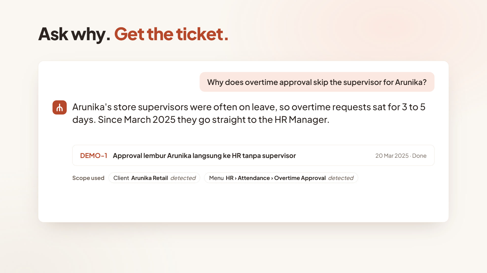
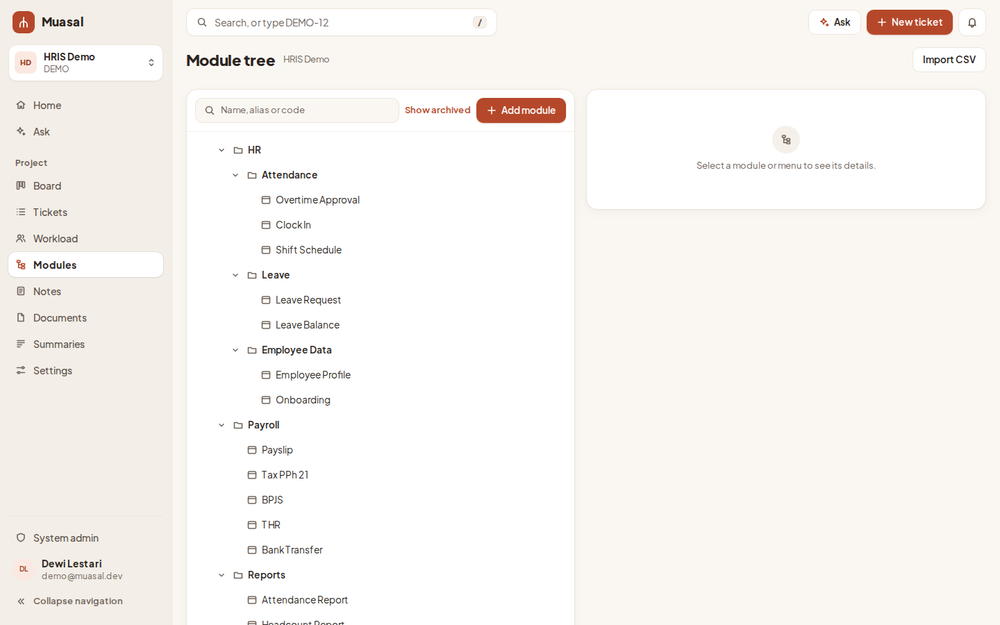
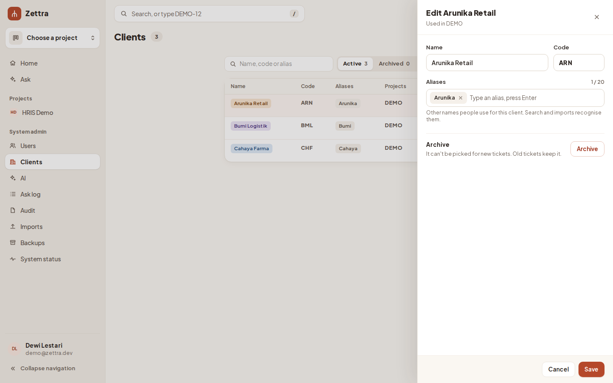
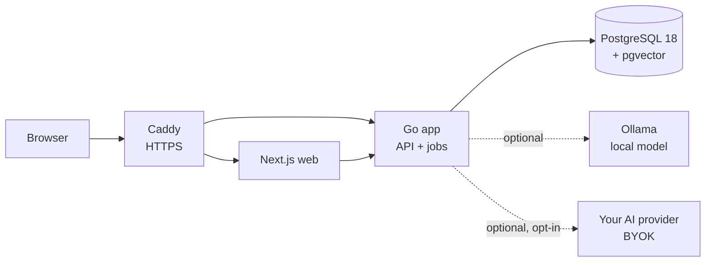

# Zettra

**The why behind every screen.** *Setiap layar punya alasan.*

Zettra is a self-hosted ticketing tool that remembers the reason behind every change to every menu. Ask it "why does this screen work like this?" and it answers with links to the tickets behind it.

**Documentation:** https://kenzo03.github.io/zettra/

> **Status: alpha (v0.1).** Zettra is looking for its first pilot teams. It is not yet production-ready: the first pilot has not run and the code has had no external security review. Try it on test data. Report problems as issues, and vulnerabilities privately as [SECURITY.md](SECURITY.md) explains. Until 1.0, an upgrade may need manual steps; each release's notes will name them. Zettra was called Muasal until 0.2; [moving a Muasal install](docs/operations.md#from-muasal-01) takes a few steps.

## Why Zettra

A product that serves many clients collects small decisions. One client wants approval to skip the supervisor, another wants two levels, a third wants a batch number on every overtime request. A year later nobody remembers why the menu behaves the way it does. The answer is buried in a chat, an email, or a ticket closed without a note.

Zettra keeps that answer next to the screen it explains:
- Closing a ticket asks what changed and why.
- Every menu shows its history, newest first.
- Ask answers questions from those records and cites the ticket behind every claim.

## Features

| | |
| --- | --- |
|  |  |
| **Menu history.** Every change to a menu with what changed, why, for which client, and who asked. | **Ask.** Answers cite a ticket for every claim, from a local model or your own key. With AI off, it returns keyword results under the same scope. |
|  |  |
| **Board and tickets.** A board and a list with filters by client, type and assignee. Moving a ticket to Done asks for its decision record. | **Module tree.** Your product's modules and menus, with aliases, so tickets and questions land on the right screen. |

Also included:
- **Tickets:** decision records, links between tickets, comments, attachments, @mentions, and AI-drafted decision records.
- **Clients:** per-client behaviour, with members scoped to the clients they serve.
- **Imports:** from Jira and CSV, and a module tree drafted from your specification document.
- **Summaries:** change summaries per client or menu, printable as PDF.
- **Connections:** Git webhooks ("Fixes DEMO-12" moves the ticket to review), in-app and email notifications, API tokens for scripts, and an MCP endpoint so AI agents such as Claude Code can work with tickets ([how](docs/mcp.md)).
- **Admin:** users, clients, AI settings, an audit log, the Ask log, backups and system status.

## How it works

- **One Go binary** serves the API and runs background jobs (indexing, notifications, backups) on PostgreSQL. There is no Redis and no message queue.
- **The web app** is Next.js. Caddy serves both over HTTPS.
- **Search and Ask** use PostgreSQL full-text search and pgvector embeddings.
- **No outbound calls:** with AI off or a local model, Zettra makes no calls out after the install. Bring your own key (BYOK) is an admin opt-in that sends questions and ticket excerpts only to the provider you name.

## Run it

| Way | For | Start here |
| --- | --- | --- |
| **Offline bundle** | A server without internet (amd64) | Download `zettra-<version>.tar` from [releases](https://github.com/Kenzo03/zettra/releases), then follow [Get a release](docs/operations.md#get-a-release) |
| **Online install** | A server that can pull images (amd64 or arm64) | `zettra-deploy-<version>.tar.gz`, then `./install.sh --online` ([Install](docs/operations.md#install)) |
| **From source** | Trying it or developing | The three commands below |

    cp deploy/.env.example deploy/.env      # then change both passwords
    make up                                  # builds and starts Caddy, web, app and PostgreSQL
    make admin EMAIL=you@example.com NAME="Your Name"

Open the printed setup link, choose a password, and sign in at http://localhost.

Releases are signed. Images are built for amd64 and arm64 with an SBOM and provenance, and the checksums carry a Sigstore signature you can check with `cosign` ([how](docs/operations.md#get-a-release)).

### AI options

| Mode | Hardware | Ask answers in |
| --- | --- | --- |
| **Off** | 4 cores, 8 GB | Keyword results in under a second |
| **Local, minimum** (`qwen3.5:4b`) | 8+ cores, 32 GB, no GPU | 45–120 s (estimate) |
| **Local, recommended** (`qwen3.5:9b`) | 8+ cores, 32 GB, a GPU with 12–16 GB | 15 s or less (target) |
| **Bring your own key** | As AI off | Depends on your provider |

Details and measurements are in [docs/hardware.md](docs/hardware.md). To run a pilot with a team, see [docs/pilot.md](docs/pilot.md).

## Status and roadmap

**Working in v0.1:** everything above. CI runs Go unit and integration tests, web checks, and a browser test suite against the full stack. A load test runs 100,000 tickets with 50 people browsing and 5 asking at once ([results](docs/hardware.md#measured)).

**Next:**
1. **Pilot.** One team uses Zettra daily for a month. This is the exit for the MVP, and its fixes come first.
2. **Sign-in and metrics (P1e):** SSO through OpenID Connect, sign-in settings, and a success-metrics dashboard.
3. **1.0:** a stable upgrade path and an external security review.

## Develop

    make testdb      # throwaway PostgreSQL on localhost:55432 for the Go tests
    make test        # Go unit and integration tests
    make generate    # regenerate Go stubs, sqlc code and TypeScript API types
    make e2e         # browser test against a running `make up` stack
    deploy/loadtest/run.sh 100000   # the 100,000-ticket load test against the stack (FSD §21.1)

The screenshots above come from the built-in HRIS demo, which `app eval --seed` loads into project DEMO.

## Contribute

See [CONTRIBUTING.md](CONTRIBUTING.md). Report vulnerabilities privately, as [SECURITY.md](SECURITY.md) explains.

## License

Apache-2.0. See LICENSE and NOTICE.
