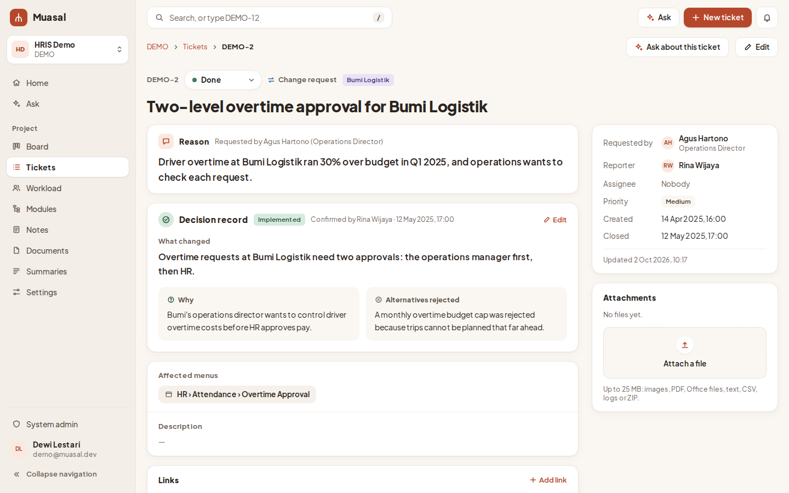
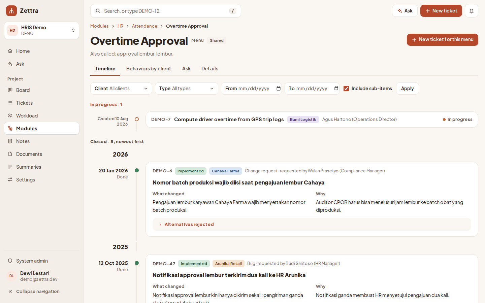
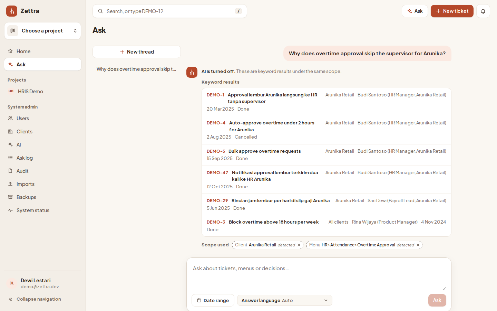
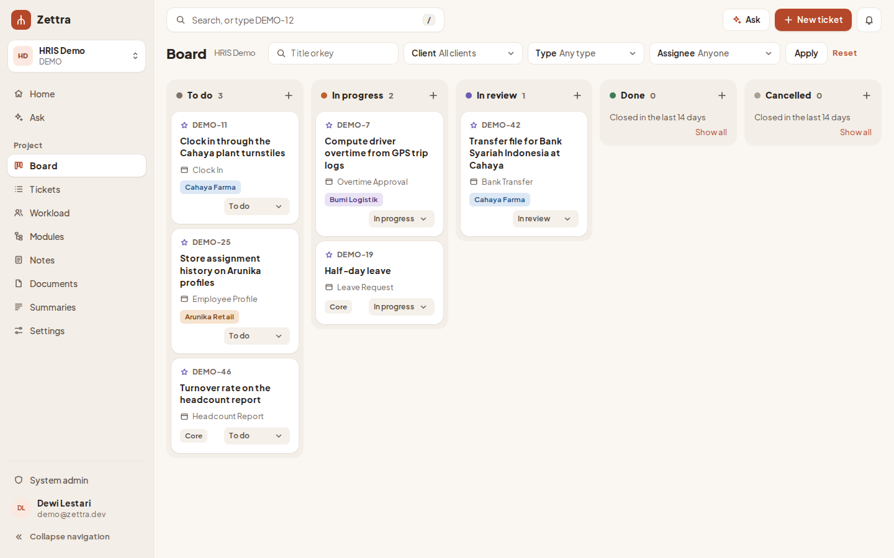

---
hide:
  - navigation
  - toc
---

# Muasal

**Know why every screen is the way it is.**

Muasal is a self-hosted ticketing tool for teams that build and maintain software for several clients. Every ticket is linked to the menus it changes, and closing it records what changed and why. A year later, anyone can open a menu and read its history, or ask "why does overtime approval skip the supervisor for Client A?" and get an answer that cites the ticket behind every claim.

[Install it](operations.md#install){ .md-button .md-button--primary }
[Source on GitHub](https://github.com/Kenzo03/muasal){ .md-button }

<video controls preload="none" poster="images/muasal-intro.jpg" style="width: 100%; border-radius: 8px">
  <source src="images/muasal-intro.mp4" type="video/mp4">
</video>

*22 seconds: a closed ticket records why, a menu keeps its history, and Ask answers with the ticket behind it.*

## Why

A product that serves many clients collects small decisions. One client wants approval to skip the supervisor, another wants two levels, a third wants a batch number on every overtime request. A year later nobody remembers why the menu behaves the way it does. The answer is buried in a chat, an email, or a ticket closed without a note.

Muasal keeps that answer next to the screen it explains.

-   **Decision records**

    ---

    A ticket cannot close without its reason and menus. Closing asks what changed, why, and what was rejected.

    

-   **Menu history**

    ---

    Each menu shows every change newest first, and the decisions in force for each client.

    

-   **Ask**

    ---

    Answers from your tickets, notes and documents, with a citation on every claim. It never uses a ticket the asker cannot open.

    

-   **Board and module tree**

    ---

    A board and list with filters by client, type and assignee, over your product's modules and menus.

    

Also included: imports from Jira and CSV, a module tree drafted from your specification, change summaries printable as PDF, Git webhooks, notifications, API tokens, and an [MCP endpoint](mcp.md) so AI agents can work with tickets.

## Your server, your data

- **Self-hosted:** one Go binary, a Next.js web app and PostgreSQL, started with Docker Compose.
- **No outbound calls:** with AI off or a local model, Muasal calls nothing outside your server after the install.
- **AI is optional:** off (keyword search), a local model through Ollama, or your own API key.
- **Indonesian and English** interface.
- **Open source** under Apache-2.0.

!!! note "Alpha (v0.1)"
    Muasal is looking for its first pilot teams. It is not yet production-ready: try it on test data. Report problems as [GitHub issues](https://github.com/Kenzo03/muasal/issues), and vulnerabilities privately as the [security policy](https://github.com/Kenzo03/muasal/security/policy) explains.

## Get started

- [Hardware guide](hardware.md): pick a server.
- [Running Muasal](operations.md): get a release, install, upgrade, back up.
- [User guide](user-guide.md): the everyday work of PMs, developers and admins.
- [Pilot kit](pilot.md): run a one-month pilot with one team.
- [Security review](security/asvs-l1.md): OWASP ASVS level 1.

To contribute, see [CONTRIBUTING.md](https://github.com/Kenzo03/muasal/blob/main/CONTRIBUTING.md).
